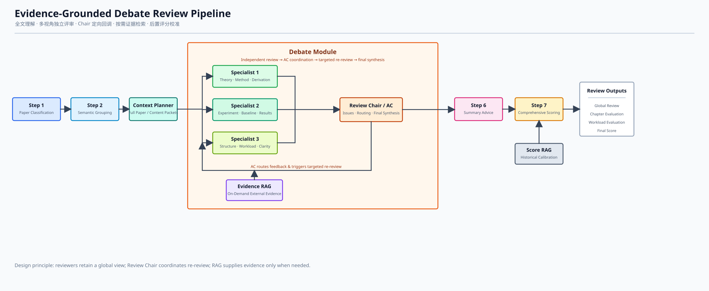

# 论文评审 Debate Multi-Agent 初始框架 V0

## 1. 设计目标

本系统围绕论文评审质量开展多视角 Debate，基于原睿文智评评测系统进行拓展，通过多个具备全文理解能力的评审 Agent 独立审阅论文、发现问题并交叉质疑，提高单 Agent 一轮推理难以达到的评审深度。

系统主要完成：

- 从理论方法、实验证据和全文质量三个视角独立评审论文；
- 汇总不同评审 Agent 之间的争议、遗漏和证据缺口；
- 对关键争议进行定向交叉质疑；
- 在必要时检索外部文献、Baseline 和引用原文作为证据；
- 形成全文级评审，再映射为原 Step 4 和 Step 5 的兼容输出；
- 在评审完成后使用RAG检索历史相关评审意见辅助 Step 7 评分校准。

## 2. 设计思路

本方案不按细碎能力分摊阅读工作，而是让多个评审 Agent 尽可能读取同一份全文上下文，从不同专业视角独立形成完整意见，再围绕争议问题进行交流。

系统采用“独立评审—争议汇总—定向 Debate—全文裁决”结构：

```text
独立：多个评审 Agent 从不同视角完成全文初审
        ↓
汇总：Review Chair 识别冲突、遗漏和证据缺口
        ↓
交互：相关 Agent 围绕关键问题交叉质疑和回应
        ↓
裁决：Review Chair 根据原文和外部证据形成全文评审
```

## 3. 总体架构

本架构中各step模块指在原睿文智评的step模块，提高了新系统与原系统的兼容性以及模块的复用性。



主流程为：

```text
Step 1 论文分类
        ↓
Step 2 章节识别与语义分组
        ↓
Context Planner
        ↓
三个全局评审 Agent 独立初审
        ↓
Review Chair 汇总争议
        ↓
定向交叉质疑 + 按需调用证据 RAG
        ↓
Review Chair 形成全文评审
        ↓
Review Chair 输出原 Step 4 / Step 5 兼容结果
        ↓
Step 6 修改建议汇总
        ↓
历史评分 RAG + Step 7 综合评分
```

Review Chair 在系统中是一个全局模块，负责汇总独立评审、组织 Debate 和形成最终全文评审。三个评审 Agent 作为专业子 Agent，不由 Review Chair 代替完成专业判断。

Context Planner、RAG 和输出兼容属于系统辅助模块，设计方法比较灵活，其中Context Planner可以选择设计为 Agent。

| 辅助模块 | 说明 |
|---|---|
| Context Planner | 根据前面步骤输出内容和论文长度准备全文上下文或语义完整内容包，保证三个评审 Agent 获得一致的全局信息。 |
| RAG | 包含 Debate 中按需调用的证据检索，以及全文评审完成后的历史评分检索；前者补充外部证据，后者只用于 Step 7 评分校准。 |
| 输出兼容 | Review Chair 直接输出 `global_review`、`chapter_evaluation` 和 `workload_evaluation`，普通代码只负责 Schema 校验和字段兼容。 |

## 4. Agent 职责

| Agent | 核心职责 | 不负责内容 |
|---|---|---|
| Review Chair | 汇总独立评审、合并重复问题、识别争议、生成定向质疑、控制 Debate、综合证据并形成全文评审 | 不重新独立完成全部理论、实验和结构评审 |
| Specialist 1/Scientific Soundness Agent | 评价理论基础、公式推导、方法合理性、研究目标与结论一致性 | 不独立决定最终评分，不只评价某一个章节 |
| Specialist 2/Empirical Evidence Agent | 评价实验设计、数据、Baseline、消融、指标、结果分析和可复现性 | 不脱离论文方法和研究目标孤立评价实验 |
| Specialist 3/Global Quality Agent | 评价全文结构、章节联系、工作量、写作清晰度、贡献完整性和问题定位 | 不代替理论或实验 Agent 完成全部专业判断 |

三个专业 Agent 都应尽可能理解论文全局，只是评审关注点不同。不同 Agent 的职责边界用于增加视角覆盖，而不是限制它们只能阅读局部内容。

## 5. 工作流程

### 5.1 上下文规划

Context Planner 根据论文篇幅和模型上下文能力，决定评审输入方式。

如果模型能够处理全文，则三个评审 Agent 都读取全文和前面步骤的总结内容。如果论文超过上下文限制，则生成“全局论文档案 + 语义完整内容包”。

该阶段形成：

- 论文研究目标和问题定义；
- 作者声明的主要贡献；
- 论文结构和章节关系；
- 全局摘要；
- 全文或语义完整内容包；
- 内容包之间的依赖关系。

方法、实验和结论等强关联内容不能仅因为章节边界而机械分开。

### 5.2 独立初审

三个专业评审 Agent 使用同一份评审上下文，分别完成独立初审。第一轮中，Agent 不能读取其他 Agent 的意见，避免相互影响和过早趋同。

每个 Agent 至少需要输出：

1. 论文研究内容总结；
2. 主要优点；
3. 主要缺点；
4. 需要作者澄清的问题；
5. 对应的原文位置和证据；
6. 问题严重程度；
7. 判断置信度；
8. 是否需要外部证据验证。

### 5.3 争议汇总

Review Chair 汇总三个 Agent 的独立评审结果，完成问题归并和争议识别。

Review Chair 需要识别：

- 不同 Agent 对同一问题结论冲突；
- 某个严重问题只有单一 Agent 提出；
- 方法评价与实验评价不一致；
- 结论缺少原文证据；
- 判断严重但置信度较低；
- 需要外部文献、Baseline 或引用原文支持的问题。

观点一致、证据充分的一般问题不需要进入 Debate。

### 5.4 定向 Debate 与证据 RAG

Review Chair 只将关键争议发送给相关 Agent，要求其阅读对方观点并进行质疑或回应，不需要所有 Agent 重新执行完整评审。

例如：

```text
Scientific Soundness Agent：方法在理论上基本成立。

Empirical Evidence Agent：实验缺少强 Baseline，无法支持方法优越性。

Review Chair：
请 Scientific Soundness Agent 说明理论成立是否足以支持论文贡献；
请 Empirical Evidence Agent 指明缺失的关键验证和对应原文位置。
```

**RAG 使用条件：** 证据 RAG 不默认覆盖所有评审问题，仅在争议依赖外部事实且仅凭论文原文无法可靠裁决时调用，主要包括：Agent 对关键结论存在冲突；创新性、引用准确性或 Baseline 完整性需要查证；公式、定义、数据集或实验规范存在疑问；高严重度问题缺少证据或判断置信度较低。结构、表达等可由论文原文直接判断的问题不触发检索。

**RAG 使用方法：** Review Chair 先将争议整理为查询任务。系统优先检索论文引用的原始文献和数据库内的类似文章，再补充同领域论文、关键方法、必要 Baseline 与实验规范；对结果进行去重、相关性排序和来源质量检查。相关 Specialist 根据证据重新评估，Review Chair 综合原文、外部证据和回应质量裁决。

**RAG 使用目的：** 证据 RAG 用于解决关键争议、增强评审结论的可核验性与可追溯性，并降低模型依赖常识猜测或生成错误事实的风险。检索结果只作为 Debate 的论证材料，不替代 Specialist 的专业判断，也不直接决定最终评审结论。

### 5.5 全文评审与兼容输出

Review Chair 根据独立评审、交叉质疑、原文证据和外部证据，形成全文级评审。

全文评审应包括：

- 论文整体总结；
- 主要优点；
- 主要缺点；
- 需要作者回答的问题；
- 理论与方法评价；
- 实验与证据评价；
- 结构与工作量评价；
- 关键证据；
- 未解决争议和结论置信度。

全文评审形成后，Review Chair 在同一次结构化输出中生成原系统需要的：

```text
chapter_evaluation
workload_evaluation
```

问题可以在输出阶段定位到具体章节，但评审推理本身不应被章节边界限制。普通代码只负责 Schema 校验、字段补全和兼容性检查。

### 5.6 修改建议与评分 RAG

原 Step 6 继续基于兼容输出汇总修改建议。Step 7 仅在全文评审和修改建议形成后执行，依据当前论文历史评分RAG的评审结论与评分规则生成评分，

**RAG使用条件：** 当任务需要输出数值评分或等级，且历史库中存在评价标准一致、元数据完整的可比案例时，评分 RAG 参与校准。论文处于等级边界、初始评分置信度较低、不同评价维度明显冲突或初始分偏离同类分布时，应重点调用。若缺少足够相似案例、历史评分标准发生变化或样本质量不足，则保留规则评分并标记校准置信度，不强行采用历史结果。

**RAG使用方法：** Step 7 将论文类型、学科方向、创新水平、工作量、问题严重程度和各评价维度结论结构化为检索条件，进行语义相似度检索。RAG 返回相似案例的评分、关键评价维度、分数分布及可比性说明；Step 7 根据历史案例评分，为本文的评分提供案例依据。

**RAG使用目的：** 评分 RAG 用于统一评分尺度、减少重复运行的分数波动，并提高不同论文之间评分的一致性和可解释性。历史评分只提供校准参照，不能反向修改独立初审、Debate 和全文评审的事实结论，也不能直接复制相似论文分数；历史简略评语不能作为当前论文存在问题的核心证据。

## 6. 最低数据接口

初始框架规定五个核心数据对象，具体字段、存储方式和框架实现由开发人员确定。

开发人员可以根据开发需要和功能实现需要设定更多的数据对象。

| 数据对象 | 最低内容 |
|---|---|
| Review Context | 全文或语义内容包以及初始步骤的输出，由Context Planner输出 |
| Independent Review | Agent 视角、优点、缺点、问题、原文证据、严重度、置信度和外部查证需求，由Specialist输出 |
| Debate Issue | 争议问题、相关 Agent、冲突观点、证据缺口和需要回答的问题，由Review Chair输出|
| Debate Response | Agent 对质疑的回应、补充证据、修订结论和修订置信度，由Specialist输出 |
| Global Review | 全文总结、优点、缺点、作者问题、分维度评价、证据、未解决争议和置信度，由Review Chair输出 |

所有进入最终全文评审的高严重度问题都应关联论文原文或外部证据。只有模型判断、没有任何证据的内容必须降低置信度或标记为待人工确认。

## 7. 评审结论

Debate 系统不使用简单多数投票形成结论。Review Chair 应综合考虑：

- 观点是否具有论文原文依据；
- 外部证据是否直接相关且来源可靠；
- 质疑是否得到有效回应；
- 方法与实验之间是否一致；
- 问题是否影响论文核心贡献；
- Agent 是否在交叉质疑后修订判断；

建议使用以下问题状态：

- 已确认；
- 基本确认；
- 存在争议；
- 证据不足；
- 需要人工复核。

最终报告应同时保留主要支持证据、相反观点和未解决问题，而不是强行消除所有分歧。

## 8. 必须遵守的架构约束

实现人员可以自由选择开发框架、模型、状态结构、数据库和调度方式，但不得改变以下原则：

1. 三个专业评审 Agent 应保持全文视角，不按章节或细碎能力过度拆分；
2. 论文只有在上下文不足时才切分，切分后必须保持语义完整性；
3. 第一轮评审必须独立完成，Agent 不能提前读取其他 Agent 的意见；
4. Debate 必须包含交叉阅读、质疑或回应，不能只有并行输出和最终汇总；
5. 历史评分 RAG 用于后置评分校准；
6. 最终评审优先从全文角度形成，再映射到具体章节；
7. Debate 应设置明确停止条件，V0 最多进行一轮交叉质疑；

## 9. V0 预期结果

第一版只需要证明以下闭环能够运行：

```text
输入论文
→ 构建全文或语义完整上下文
→ 三个专业 Agent 独立初审
→ Review Chair 识别关键争议
→ 完成一轮定向交叉质疑
→ 按需检索外部证据
→ 形成全文评审
→ Review Chair 输出原 Step 4 / Step 5 兼容结果
→ 完成后续论文打分等工作
```
