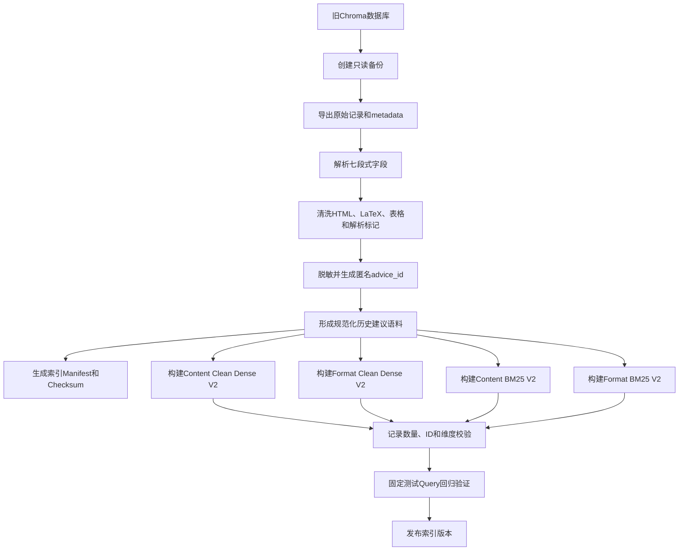
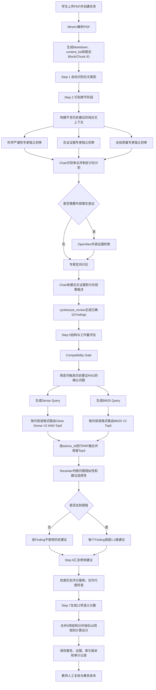

# 历史建议 RAG 完整改造与向量库重建方案

## 文档状态

- 状态：代码链路已实施并通过自动测试；真实索引构建、人工标注和效果评测待数据环境执行
- 更新日期：2026-08-24
- 当前分支：`feature/review-table-export`
- 适用范围：历史修改建议 RAG
- 不包含：OpenAlex 外部证据检索、历史评分案例校准 RAG
- 恢复口令：用户提出“执行历史建议 RAG 改造方案”时，先读取本文档，检查当前分支和数据库备份，再按实施阶段执行

## 已确认决策

1. 历史建议 RAG 必须位于多智能体确认问题之后、Step 6 之前。
2. RAG 按已确认 Finding 检索，不再按所有章节无条件检索。
3. 旧 Chroma 数据库原样只读保留，不删除、不覆盖。
4. 从旧库导出并清洗出规范化语料，作为新索引的统一数据源。
5. 使用规范化语料同时建立 Clean Dense V2 和 BM25 V2。
6. 正式混合召回使用 Clean Dense V2、BM25 V2、RRF 和 Reranker。
7. 旧 Dense 仅用于基线、回退和迁移审计，不默认进入最终三路融合。
8. 修改建议不进入主问题 Embedding，也不参与第一阶段 BM25 计分。
9. 修改建议保存在规范化语料中，通过 `advice_id` 在 Reranker 与 Step 6 阶段补全；Chroma 只保存最小索引 metadata。
10. 原始 Chunk 永久保留用于审计，清洗过程只产生派生索引。

## 向量库重建对原方案的影响

向量库重建会调整原方案的数据层和上线顺序，但不会改变原方案的核心工作流。

### 保持不变

- 三个专家必须先独立评审；
- Chair 必须先根据论文证据确认问题；
- 没有确认问题时，历史建议查询次数为 0；
- 历史建议只能帮助生成修改方案，不能证明问题存在；
- 历史建议不能改变问题严重程度；
- 历史建议不能直接参与 Step 7 评分；
- Dense 与 BM25 经过 RRF 后仍需 Reranker；
- 每个问题最终只保留少量高相关建议。

### 需要调整

原方案的数据路径是：

```text
旧 Chroma Dense
+ 新 BM25
-> 混合召回
```

调整后的正式路径是：

```text
规范化语料
-> Clean Dense V2
-> BM25 V2
-> RRF
-> Reranker
```

旧 Chroma Dense 保留为：

```text
迁移基线
+ 回退路径
+ 原始数据审计来源
```

因此，向量库重建不是另一个独立项目，而是历史建议 RAG 改造的数据准备阶段。

## 真实数据库核验结论

真实数据库已完成核验。数据库中的历史建议记录总体与样本 `content_201300096_71` 相似，采用一条建议对应一条逻辑记录的七段式结构：

```text
论文标题
所属章节
问题位置
上下文
修改建议
分析过程
原文片段
```

典型特点：

- 一条记录通常描述一个具体历史问题；
- 问题位置可以定位到章节或小节；
- 上下文描述问题发生的研究场景；
- 修改建议给出可执行修正方向；
- 分析过程包含问题诊断、评审项和专业术语；
- 原文片段包含历史证据，但常混有 LaTeX、HTML 表格、Markdown 转义和解析标记；
- 旧 ID 可能包含学号等敏感标识。

核验后的字段职责：

| 字段 | 主要用途 | 是否进入主问题索引 |
|---|---|---:|
| 论文标题 | 原始审计和展示 | 否 |
| 所属章节 | 章节阶段和范围 | 是，低权重 |
| 问题位置 | 问题定位 | 是 |
| 上下文 | 历史问题发生场景 | 是 |
| 修改建议 | 召回后的建议载荷 | 否 |
| 分析过程 | 历史问题诊断 | 是，最高价值 |
| 原文片段 | 审计和证据对照 | 只使用清洗后的短证据 |

## 为什么保留旧数据库

旧 Chroma 数据库不得原地修改，原因包括：

- 保持旧项目兼容；
- 防止字段解析或清洗错误造成不可逆损失；
- 保留原始向量作为检索基线；
- 支持新旧 Dense 的 A/B 对比；
- 新索引故障时可以回退；
- 保留原始论文证据和完整审计记录。

旧库定义为：

```text
legacy_dense
```

旧库不再被视为新方案的唯一生产索引。

## 四层数据结构

### 第一层：旧 Chroma

保存：

- 原始 Chunk；
- 原始 Embedding；
- 原始 metadata；
- legacy ID；
- 完整原文片段。

用途：

- 只读数据源；
- 基线测试；
- 故障回退；
- 审计和追溯。

### 第二层：规范化语料

建议保存为版本化 JSONL，也可以同步到 SQLite。它是 Clean Dense V2 和 BM25 V2 的共同权威来源。

概念性记录：

```json
{
  "advice_id": "adv_6e931f...",
  "legacy_id_internal": "仅服务端保存",
  "source_collection": "content",
  "advice_type": "content",
  "paper_type": "method",
  "chapter": "第四章 实验",
  "chapter_stage": "实验结果分析",
  "position": "4.2.1 主实验结果",
  "issue_category": "statistical_validation_missing",
  "dimension_ids": ["11", "12", "16"],
  "problem_text": "仅通过数值比较认定模型性能更好，缺少统计显著性检验，也未说明实验重复次数和数据划分方式。",
  "context_text": "本节比较所提模型与基线模型，使用MSE和RMSE作为评价指标。",
  "evidence_excerpt": "论文列出单次MSE和RMSE结果后，直接认定所提模型性能最好。",
  "suggestion": "增加统计显著性检验，并补充实验重复次数和数据划分方式。",
  "raw_document_checksum": "sha256:...",
  "schema_version": "historical_advice_v2"
}
```

`legacy_id_internal` 不得传给模型或前端。

### 第三层：Clean Dense V2

建议建立两个新 Chroma collection：

```text
historical_advice_content_clean_v2
historical_advice_format_clean_v2
```

每条记录的 `document` 是历史问题表示，不包含修改建议：

```text
问题类型：实验统计验证不足
章节阶段：实验结果分析
问题位置：主实验结果
历史问题诊断：仅通过MSE和RMSE数值比较认定模型性能更好，缺少统计显著性检验，也未说明实验重复次数和数据划分方式。
历史上下文：本节比较所提模型与基线模型，使用MSE和RMSE作为评价指标。
历史证据摘要：论文列出单次结果后，直接认定所提模型性能最好。
```

该文本通过 `Qwen/Qwen3-Embedding-8B` 生成 4096 维向量。

Clean Dense V2 的召回方式是 Chroma ANN，索引明确采用 HNSW 和 cosine 距离。HNSW 负责近似最近邻候选搜索，cosine 用于衡量 Query 向量与历史问题向量的方向相似度。

Chroma metadata 建议包含：

```json
{
  "advice_id": "adv_6e931f...",
  "suggestion": "增加统计显著性检验，并补充实验重复次数和数据划分方式。",
  "source_collection": "content",
  "advice_type": "content",
  "paper_type": "method",
  "chapter_stage": "实验结果分析",
  "issue_category": "statistical_validation_missing",
  "dimension_ids": "11,12,16",
  "schema_version": "historical_advice_v2",
  "record_checksum": "sha256:..."
}
```

`suggestion` 保存在 metadata 中，但不参与 Embedding 计算。

### 第四层：BM25 V2

建议分别建立 content 和 format 的 BM25 索引。BM25 的索引文本与 Clean Dense V2 对齐：

```text
issue_category
+ chapter_stage
+ position
+ problem_text
+ context_text
+ evidence_excerpt
```

BM25 不索引：

- 完整修改建议；
- 完整原文片段；
- 论文标题；
- 学号或姓名；
- LaTeX 公式；
- HTML 表格标签；
- MinerU 块标记。

BM25 结果至少返回：

```text
advice_id
bm25_score
bm25_rank
```

再通过 `advice_id` 取得规范化记录和修改建议。

## 清洗规则

旧记录必须先解析七个字段，再生成派生字段。

### 文本规范化

- 解码 `&#x20;` 等 HTML Entity；
- 合并 PDF 换行造成的断句；
- 合并多余空白；
- 统一全角半角和英文大小写；
- 清理 Markdown 转义；
- 删除无意义的“块 N/M”等解析标记；
- 删除重复的字段标签和模板前缀。

### 公式处理

- 删除完整 LaTeX 表达式；
- 保留 MSE、RMSE、F1、AUC 等指标名；
- 保留公式类型和必要变量名；
- 原公式继续存在于旧库，不写入主检索文本。

### 表格处理

- 删除 HTML 标签；
- 必要时转为简短纯文本；
- 只保留对问题诊断有帮助的表头、指标和结论；
- 不把完整长表写入 Embedding 或 BM25。

### 分析过程处理

- 保留具体问题诊断；
- 保留专业术语；
- 将评审项编号映射为 `dimension_ids`；
- 删除“从原文块 N 可以看出”等低价值模板；
- 删除姓名、学号和文件路径；
- 无法可靠分类时允许 `issue_category` 为空，不能强行生成标签。

### 原文片段处理

原始全文仍保存在旧库。新索引只保留短 `evidence_excerpt`：

- 优先选择与 `problem_text` 术语重合的原文句子；
- 不超过约 300 字；
- 无法可靠提取时允许为空；
- 不使用自由生成摘要替代原文证据。

## 匿名稳定 ID

旧 ID 可能包含学号，不能直接复用到外部输出。

建议：

```text
advice_id = SHA256(source_collection + legacy_id + raw_document_checksum)
```

要求：

- 相同原始记录重复构建得到相同 ID；
- content 与 format 不发生冲突；
- 新旧索引使用相同 `advice_id`；
- legacy ID 只保存在受限映射表；
- 日志和前端只显示匿名 `advice_id`。

## 当前问题 Query 设计

RAG 只为 Chair 已确认的问题构造 Query。

### Dense Query

```text
问题类型：实验统计验证不足
章节阶段：实验结果分析
问题位置：主实验结果

确认问题：
论文仅根据MSE和RMSE数值比较认定模型优于基线，
未提供统计显著性检验、实验重复次数和数据划分方式。

证据原文：
所提模型的MSE低于基线模型，因此所提模型拥有最好的性能。

局部上下文：
本节使用MSE和RMSE比较所提模型和两个基线模型，
但没有说明多次实验、方差、置信区间和数据集划分过程。
```

Dense Query 包含：

- 标准化问题类型；
- 章节阶段；
- 问题位置；
- Chair 确认的问题；
- 当前论文原文证据；
- 证据附近的局部上下文。

Dense Query 不包含：

- 论文标题；
- 摘要；
- 全文关键词；
- 整章正文；
- 历史修改建议；
- 当前论文分数；
- 其他未确认问题；
- 学生身份信息。

`paper_type`、`advice_type` 和未来的 `discipline_id` 优先作为过滤或路由条件，不重复堆入 Embedding 文本。

### BM25 Query

由同一个 Finding 确定性提取高区分度词语：

```text
实验结果 数值比较 MSE RMSE 统计显著性 重复实验 数据划分 置信区间 基线模型
```

允许使用受控专业词典扩展同义词，但第一阶段不使用 LLM 自由改写 Query。

## Query 与历史向量的字段对齐

| 当前 Dense Query | 历史 Clean Dense V2 |
|---|---|
| 问题类型 | issue_category |
| 章节阶段 | chapter_stage |
| 问题位置 | position |
| 确认问题 | problem_text |
| 当前证据 | evidence_excerpt |
| 当前局部上下文 | context_text |

双方都描述“问题是什么”，因此可以进行稳定的语义相似度比较。

修改建议不在这一步参与匹配。

## 索引重建工作流



索引 Manifest 至少记录：

```text
schema_version
source_database_checksum
record_count
content_count
format_count
embedding_model
embedding_dimensions
distance_metric
tokenizer_version
stopword_version
terminology_version
build_time
builder_version
```

## RAG 触发条件

默认触发：

- Chair 状态为 confirmed 的 Finding；
- 有论文原文证据；
- `fatal`、`major`、`moderate`；
- Step 5 确定性检查确认的格式或结构问题；
- 同类 `minor` 问题可以合并查询。

默认跳过：

- dismissed；
- insufficient；
- 仅要求人工核对但没有确认；
- 没有原文证据；
- 需要验证创新性、文献真实性或外部事实的问题，此类问题优先走外部证据检索。

如果没有确认问题，历史建议查询次数为 0。

## 内容与格式路由

- 内容问题只查 content Clean Dense V2 和 content BM25 V2；
- 格式问题只查 format Clean Dense V2 和 format BM25 V2；
- 类别不确定时才查两个索引；
- `paper_type` 作为 metadata 过滤；
- `chapter_stage` 可以作为软约束，不应在数据稀少时过度过滤；
- 未来 `discipline_id` 由专业 Skill 决定检索命名空间。

## 混合召回和精排

每个确认问题的初始参数：

```text
Clean Dense V2 ANN Top 5
BM25 V2 Top 5
-> advice_id 合并
-> RRF 融合 Top 3
-> Reranker
-> 相关性阈值
-> 语义去重
-> 最终保留 0-2 条
```

RRF 初始公式：

```text
score = 0.55 / (60 + dense_rank)
      + 0.45 / (60 + bm25_rank)
```

该权重只是初始值，必须通过标注集调整。

### Reranker 输入

```text
当前确认问题
+ 当前证据和位置
+ 历史 problem_text
+ 历史 context_text
+ 历史 evidence_excerpt
+ 历史 suggestion
```

Reranker 判断：

1. 历史问题是否与当前问题相似；
2. 历史修改建议是否适用于当前论文；
3. 建议是否过度、缺失或依赖不存在的条件。

修改建议在这里首次进入模型判断，但仍不用于证明当前问题存在。

## Step 6 输出约束

每条命中建议至少绑定：

```text
finding_id
advice_id
source_collection
dense_rank
bm25_rank
rrf_score
rerank_score
index_version
```

Step 6 必须：

- 结合当前论文证据改写建议；
- 不直接复制历史建议；
- 不增加新的未确认问题；
- 不提高问题严重程度；
- 不暴露历史学生信息；
- 每个问题最多使用 1-2 条；
- 全文历史建议总量建议控制在 10-15 条以内。

## 修改后的完整运行工作流



该工作流中，历史建议 RAG 不进入三个专家的独立初审，也不进入问题是否成立的裁决阶段。

## 与当前实现的主要差异

| 环节 | 当前实现 | 改造后 |
|---|---|---|
| 触发时机 | Step 2 后、专家评审前 | Chair确认问题和Step 5后 |
| 检索粒度 | 每个可评审章节 | 每个已确认Finding |
| Dense数据 | 原始七段式Chunk整体向量 | 清洗后的历史问题表示 |
| BM25 | 无 | BM25 V2 |
| Query | 标题、摘要、关键词、整章 | 问题、位置、证据、局部上下文 |
| 内容/格式路由 | 同时查询两个集合 | 根据Finding类型路由 |
| 融合 | 按Chroma distance排序 | RRF |
| 精排 | 无 | Reranker |
| 阈值 | 无 | 校准阈值，允许返回空 |
| 建议数量 | 每章最多5条 | 每问题1-2条、全文10-15条 |
| 评分影响 | 可能通过专家上下文间接影响 | 不参与独立判断和直接评分 |
| 数据隐私 | 可能带旧ID和原文 | 匿名ID、清洗文本和受限原始映射 |

## 迁移和上线策略

### 阶段一：离线构建

- 备份旧 Chroma；
- 导出和解析真实记录；
- 生成规范化语料；
- 构建 Clean Dense V2；
- 构建 BM25 V2；
- 生成索引 Manifest；
- 不修改线上工作流。

### 阶段二：离线评测

至少比较：

```text
A：当前章节级 Legacy Dense
B：确认问题后的 Legacy Dense
C：确认问题后的 Legacy Dense + BM25
D：确认问题后的 Clean Dense V2
E：确认问题后的 Clean Dense V2 + BM25 + Reranker
```

### 阶段三：旁路运行

- 正式报告继续使用旧路径或不使用历史建议；
- 新路径并行运行但只记录结果；
- 教师对候选相关性和建议可执行性标注；
- 检查隐私、延迟和空结果行为。

### 阶段四：正式切换

只有 E 方案通过验收后：

- Clean Dense V2 + BM25 V2 成为默认路径；
- Legacy Dense 保留为只读回退；
- 通过配置开关控制新旧路径；
- 每次任务记录索引版本。

## 评估指标

- Dense `Recall@5`；
- BM25 `Recall@5`；
- 融合候选 `Recall@3`；
- `MRR@3`；
- `nDCG@3`；
- 最终 `Precision@2`；
- 应返回空结果时的准确率；
- 无关建议率；
- 教师建议采用率；
- 证据与问题匹配率；
- 历史建议原文复制率；
- 隐私泄露率；
- 每问题延迟；
- 每篇论文总延迟；
- Embedding、Reranker和存储成本；
- 加入历史建议前后Finding数量、严重程度和分数是否发生非预期变化。

上线标准不是召回数量更多，而是：

> 已确认问题能够获得更相关、更可执行的建议，同时不增加问题误报、不改变独立评分、不泄露历史学生信息。

## 回退与故障处理

- 规范化记录解析失败：记录错误并跳过，不修改旧库；
- Clean Dense 构建失败：删除未发布的新版本集合，旧库不受影响；
- BM25 构建失败：不发布索引版本；
- Dense 查询失败：可以降级为 BM25 + Reranker；
- BM25 查询失败：可以降级为 Clean Dense + Reranker；
- Reranker失败：默认不使用低置信历史建议，或按配置回退到严格Top候选；
- 新索引整体异常：切回 Legacy Dense 或关闭历史建议 RAG；
- 任何降级都必须写入任务 issues 和审计日志。

## 实施阶段

1. 创建旧数据库只读备份和索引构建工作目录。
2. 实现七字段解析、清洗、脱敏和匿名ID生成。
3. 生成版本化规范化语料与 Manifest。
4. 建立 content/format Clean Dense V2。
5. 建立 content/format BM25 V2。
6. 实现问题级 Dense Query 和 BM25 Query。
7. 实现内容/格式路由、metadata过滤和RRF融合。
8. 接入Reranker、阈值、语义去重和数量限制。
9. 将历史建议节点移动到Chair裁决与Step 5之后。
10. 修改Step 6，使建议按finding_id绑定并改写。
11. 增加索引版本、来源和分数审计字段。
12. 建立A-E离线评测和固定测试Query。
13. 进行旁路运行和教师标注。
14. 验收后通过配置开关正式切换。

## 实施状态

已实现并有自动测试覆盖：

- Canonical JSONL、稳定匿名 `advice_id`、三种检索文本视图和 Manifest；
- `Qwen3-Embedding-8B/4096` Dense V2 旁路构建器；
- 共享 Jieba Tokenizer 的 BM25 V2 旁路构建器；
- Finding 级 Dense Top5 + BM25 Top5 + 加权 RRF Top3；
- BM25 独立命中的 Canonical 记录补全、精确/语义近似去重和组件级降级；
- `Qwen3-Reranker-0.6B` 批量精排接口；
- Chair/Step 5 之后、Step 6 之前的检索节点；
- Step 6 真实消费历史建议，并保留最多两条来源；
- Step 7 在工作流和真实模型载荷两层隔离历史建议；
- `off / shadow_v2 / v2` 发布模式；
- 分离旧新 Embedding 空间的 A-E 标注评测 CLI。

尚未完成，因而不能对外宣称召回效果已提升：

- 当前仓库不包含敏感旧 Chroma，未在本机生成真实 Dense/BM25 索引；
- 未建立教师标注的 Query/qrels 集，未产出 Recall/MRR/nDCG 报告；
- Step 5 格式项目还没有转换为带原文证据的标准 Finding，因此当前在线召回仍以 Chair Finding 为主；
- metadata 中历史 `paper_type` 缺失较多，尚未启用强制论文类型过滤；
- 降级会写入结构化服务日志，但 Dense/BM25 分组件 warning 还未单独进入任务 `issues`。

因此当前可以表述为“混合RAG代码链路已实现并通过自动测试”，
不能表述为“真实数据上的召回质量已验证”。

## 执行前检查

收到“执行历史建议 RAG 改造方案”后：

1. 读取本文档和当前分支代码；
2. 确认旧 Chroma 路径和只读备份位置；
3. 再次运行自动预检，核对集合、记录数、向量维度和metadata；
4. 固定规范化 Schema 与索引版本名；
5. 准备少量固定 Query 和人工相关性标签；
6. 先实现离线索引构建，不立即改线上工作流；
7. 每个阶段完成测试和报告后再进入下一阶段。
