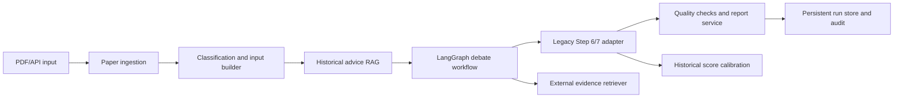

# 旧论文评审后端迁移与多智能体完善计划

## 1. 目标与边界

目标是把 `paper-review-backend/dev` 中已经验证过的论文解析、历史建议检索、评分、辅助检测和报告能力，以适配器方式迁入当前 LangGraph 多智能体后端，并逐步替换 Demo 服务。系统保持通用论文评审边界，不在核心流程中绑定学校或院系规则。

当前阶段只建设后端。前端不实现，但 API、异步任务状态、结果数据契约和错误码需要稳定，避免未来前端依赖内部 Agent 状态。

## 2. 当前基线

新项目已经具备：

- LangGraph 主流程：上下文构造、三专家独立初审、Chair 争议路由、定向辩论、综合裁决、Step 6/7 兼容输出。
- 三个真实 Specialist 和真实 Review Chair，共用 OpenAI 兼容模型客户端。
- 严格 Pydantic 数据契约、失败降级、并发控制和最小可用 API。
- Step 4/5 输出兼容层，以及 Step 6/7、外部证据、历史评分的端口。

已经完成或已接入雏形：

- PDF 上传、MinerU 解析、Markdown 结构化和一体化评审任务接口。
- 原 Step 1 论文类型自动分类与 Step 2 三套章节阶段分类标准，使用严格 Schema
  按 `chapter_id` 回填。
- 原 Step 3 两个历史专家建议 Chroma 集合和 DashScope embedding 兼容。
- 原 Step 7 十二维定义复用、LLM 评分和确定性总分计算。
- 真实模式 Demo 证据隔离、论文引文定位校验和同步模型并发隔离。

仍缺失的生产能力：

- Step 4/5 旧模型提示词的进一步拆分复用和评分规则版本迁移工具。
- 可比较历史评分案例检索、真实外部学术证据检索。
- AIGC、图表上下文、参考文献、PDF 标注和报告生成。
- 持久化任务、权限、审计、可观测性、评测集和部署治理。

## 3. 复用决策

| 旧模块 | 决策 | 新项目落点 | 说明 |
| --- | --- | --- | --- |
| MinerU PDF 转 Markdown | 适配复用 | `ingestion/mineru.py` | 改为异步客户端、超时/重试和配置化路径 |
| `ChineseMarkdownSplitter` | 拆分复用 | `ingestion/markdown_parser.py` | 保留章节与位置算法，拆除全局状态和文件副作用 |
| 论文/章节分类 Prompt | 复用 Prompt 与规则 | `classification/` | 输出改为严格 schema，加入版本号 |
| Chroma + CloudEmbeddings | 数据兼容复用 | `services/historical_advice.py` | 不把 LangChain 链带入 LangGraph；复用库和 `embed_query` 接口 |
| 历史专家建议检索 | 适配复用 | `HistoricalAdviceRetriever` | 结果进入 `DebateReviewInput.step3_advice` |
| Step 6/7 | 拆函数复用 | `OriginalPipelineAdapter` | 从巨型 router 提取纯业务函数，禁止依赖请求上下文 |
| 历史用户结果向量库 | 扩展后复用 | `HistoricalScoreRetriever` | 旧元数据缺少稳定评分维度，需重建索引契约 |
| 参考文献/图表/AIGC | 分阶段适配 | `quality_checks/` | 作为独立检查结果输入 Chair，不阻塞核心评审 |
| PDF 标注/LaTeX 报告 | 适配复用 | `reports/` | 消费最终领域结果，不反向耦合工作流 |
| 旧 routers、鉴权、JSON 文件存储 | 不直接迁移 | 新 API/基础设施 | 存在巨型模块、硬编码路径、同步阻塞和敏感日志风险 |

## 4. 关键语义约束

1. 历史专家建议是评审经验，不是外部事实证据。它只能进入 `step3_advice`，不能进入 `external_evidence`。
2. 历史评分案例只在事实评审完成后用于尺度校准，不能改变已确认的事实判断。
3. 外部证据必须提供可追溯 DOI 或 URL，并记录检索时间、来源和引用片段。
4. 三位专家必须先独立评审，再接收 Chair 的定向争议问题，避免意见串扰。
5. 模型输出、Prompt 版本、检索结果和人工修订都需要审计，但不保存模型隐藏推理过程。
6. 姓名、学号和论文正文属于敏感数据，不写入日志或无隔离的向量元数据。

## 5. 目标架构

各层只通过 Pydantic 契约和 Protocol 交互。第三方 SDK、Chroma、对象存储和数据库实现均放在适配器层，领域模型不导入 LangChain、Chroma 或 Web 框架。

## 6. 实施里程碑

### M1：历史建议 RAG 接入

- 增加 `HistoricalAdviceRetriever` 端口。
- 在 `build_context` 前增加 LangGraph 检索节点。
- 兼容旧 Chroma collection 和 `CloudEmbeddings.embed_query()`。
- 保留调用方已有建议，按章节去重并限制上下文数量。
- 向量库失败时记录 warning，继续核心评审。

验收：旧 Chroma 测试数据可映射为 `RetrievedAdvice`；建议在 Specialist 开始前已进入共享上下文；检索失败不导致整次任务失败。

### M2：论文摄取与结构化

- 抽取 MinerU 客户端，增加上传校验、轮询超时、重试和错误分类。
- 拆分 Markdown 解析器，输出论文元数据、章节树、公式/字数和 PDF 位置。
- 建立 `PaperIngestionResult -> DebateReviewInput` 构建器。
- 对扫描件、空文档、超大论文和解析不完整提供显式状态。

验收：使用脱敏毕业论文样本验证章节完整率、标题层级准确率和位置映射；同一文件重复摄取具有幂等键。

### M3：分类与旧 Step 3 数据迁移（分类适配已完成）

- 已迁入论文类型、章节阶段分类规则和严格 Schema 适配器。
- 已为分类来源和规则增加版本字段；模型版本审计随持久化任务实现。
- 编写旧 Chroma 数据审计和重建脚本，生成稳定 chunk ID。
- 元数据仅保留论文类型、章节阶段、建议类别、匿名案例 ID 和版本。

验收：固定评测集上的论文类型准确率、章节阶段宏平均 F1 达标；抽样检查建议检索相关性和敏感字段清除情况。

### M4：Step 6/7 生产适配器

- 从旧 `evaluation.py` 提取总结建议和综合评分纯函数。
- 通过 `OriginalPipelineAdapter` 接入，不在函数内读取全局任务状态。
- 明确 12 个评分维度、权重、分数范围、等级映射和缺失值处理。
- 对新旧系统运行影子对比，记录差异原因。

验收：相同输入的字段结构完全兼容；确定性规则无随机漂移；模型参与部分记录模型与 Prompt 版本。

### M5：历史评分校准

- 定义包含匿名案例 ID、维度分数、总分、论文类型和裁决摘要的新索引。
- 从旧结果中迁移可验证记录，缺失维度的数据不得伪造。
- 检索发生在综合事实评审之后，并输出 calibration notes。
- 增加异常历史分数和数据污染检测。

验收：校准案例可解释、可追溯；移除校准器不改变事实 findings；分数变化在配置阈值内。

### M6：外部证据与辅助检查

- 接入 Crossref、OpenAlex 或院校许可的数据源，证据必须带 DOI/URL。
- 迁入参考文献验证、图表上下文评估和 AIGC 检测。
- 检查结果作为独立证据包交给 Chair，并标记置信度和人工复核要求。
- 第三方服务不可用时分别降级，不相互拖垮。

验收：引用可访问率、证据支持率、误报率和服务降级行为均有自动化测试。

### M7：API、持久化和报告

- 增加 PDF 上传、任务创建、状态查询、结果查询、取消和重试 API。
- 使用 PostgreSQL 保存任务、状态、结果摘要和审计；对象存储保存原文和报告。
- 用 Redis/任务队列替换内存任务执行，支持进程重启恢复。
- 迁入 PDF 标注和正式报告生成，报告记录版本和校验哈希。

验收：OpenAPI 契约测试通过；任务可恢复；重复提交幂等；报告与 API 结果一致。

### M8：权限、安全和上线治理

- 建立学校、院系、管理员、教师和只读审计角色。
- 落实最小权限、传输/静态加密、数据保留期限和删除流程。
- 禁止记录密码、Token、完整论文正文和学生身份向量。
- 增加限流、文件类型/大小校验、恶意 PDF 隔离和依赖漏洞扫描。
- 建立灰度、回滚、人工复核和申诉流程。

验收：完成威胁建模、权限矩阵测试、恢复演练和校方数据治理确认后，才可进入正式评审。

## 7. API 预留

建议稳定的资源模型：

- `POST /api/papers`：上传或登记论文，返回 `paper_id`。
- `POST /api/review-runs`：创建评审任务，支持幂等键和配置版本。
- `GET /api/review-runs/{run_id}`：返回状态、阶段、非敏感进度和错误码。
- `GET /api/review-runs/{run_id}/result`：返回结构化评审结果。
- `POST /api/review-runs/{run_id}/cancel`：取消未完成任务。
- `POST /api/review-runs/{run_id}/human-review`：提交人工确认或修订。
- `GET /api/review-runs/{run_id}/report`：获取带版本的报告地址。

API 不暴露内部 LangGraph node 名称作为永久契约；通过稳定阶段枚举映射，便于日后调整 Agent 图。

## 8. 测试与评测

- 单元测试：解析、映射、去重、评分规则和安全过滤。
- 契约测试：每个端口、Pydantic schema、OpenAPI 响应和旧 Step 4/5/6/7 形状。
- 集成测试：MinerU、Chroma、模型网关、数据库和对象存储使用可替换测试环境。
- 回归集：脱敏论文覆盖理论研究、方法创新、工程实现，以及不同篇幅和格式质量。
- Agent 评测：事实支持率、专家一致/分歧质量、严重问题召回率、无依据断言率。
- RAG 评测：Recall@k、MRR、建议相关率、重复率和跨论文类型误检率。
- 运营指标：单篇耗时、Token 成本、外部服务失败率、人工复核率和评分漂移。

所有模型或 Prompt 升级必须先跑固定回归集，并保存与生产版本的差异报告。

## 9. 合理性检查结论

- **分层合理**：复用的是已经验证的业务算法和数据，不复用旧 router、全局状态和基础设施债务。
- **语义合理**：历史建议、外部事实、历史评分三类 RAG 有独立端口和不同介入时机，避免相互污染。
- **演进合理**：先打通建议检索，再迁 PDF 和 Step 6/7，每个里程碑都可独立测试和回滚。
- **成本合理**：Chroma 适配器兼容旧 embedding 接口，不要求第一阶段重做全部向量数据或保留 LangChain。
- **上线约束合理**：M1-M6 只能视为功能建设；持久化、安全、审计和人工复核完成前，不应直接用于正式毕业论文裁决。

## 10. 当前分支范围

`codex/production-pipeline` 在最新 `feature/real-agents` 基线上完成 M1、M2 的可运行
后端链路和 M3 的 Step 1/2 分类适配，并吸收新提交的真实 Step 6/7 适配器。范围包括
PDF 校验、MinerU 上传与轮询、安全解压、Markdown 章节解析、论文类型自动分类、三套
章节阶段分类、结构化输入构建、一体化任务接口、旧历史建议 Chroma 兼容、Demo 数据
隔离、证据引用校验和任务失败语义。旧库审计重建、历史评分 RAG、外部学术证据、
持久化、权限审计和正式报告仍留在后续里程碑。
